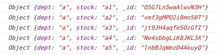

# Database records

Our offline-first strategy creates a local Feathers service
containing a copy of the records on a remote Feathers service,
or of only a subset of them.

The remote database may be any having a Feathers adapter: NeDB, MongoDB, Sequelize, etc.
The local database may be any having a Feathers adapter than can reside data on the local platform.
For example:

Its not possible to exactly copy the contents of one Feathers service to another.
Some databases use `_id` as their record id, while others use `id`.
Some have string ids, while others use numbers.
Some allow you to set the id when the record is bring created,
others set the id themselves.

Therefore the layout of the local database differs slightly from the remote's.

Its non uncommon for records to contain the keys of other records.
These references are retained in the local copies,
you just have to understand how.

## Snapshot and Realtime record layouts

Assume the remote service has this layout.

The local service will have this layout using the snapshot or realtime strategies.

The remote service's `id` is renamed `__id` on the local service.
The remote's `_id` as `___id`.