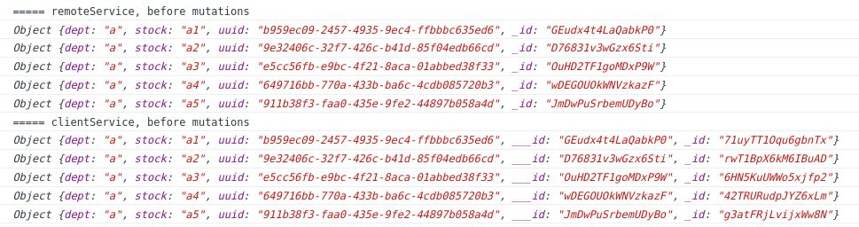

# Database records

Our offline-first strategy creates a local Feathers service
containing a copy of the records on a remote Feathers service,
or of only a subset of them.

The remote database may be any having a Feathers adapter: NeDB, MongoDB, Sequelize, etc.
The local database may be any having a Feathers adapter than can reside data on the local platform.
For example:


Its not possible to exactly copy the contents of one Feathers service to another.
Some databases use `_id` as their record id, while others use `id`.
Some have string ids, while others use numbers.
Some allow you to set the id when the record is bring created,
others set the id themselves.

Therefore the layout of the local database differs slightly from the remote's.
However these will have a minimal impact on your existing database design,
as that was one of our goals.

Its non uncommon for records to contain the keys of other records.
These references are retained in the local copies,
you just have to understand how.

## Record layouts for snapshot and realtime

Assume the remote service has this layout.


The local service will have this layout using the snapshot or realtime strategies.


The remote service's `id` is renamed `__id` on the local service.
The remote's `_id` as `___id`.

If you would search the remote service for records having a specific `id` value,
you can search the local service for that `__id` value.

> **ProTip** IMPORTANT: Do not depend on the local service's `id` and `_id` values.
They are likely to change when the client service recovers from a disconnection.

## Record layouts for other strategies

The remaining strategies require you have a
[`uuid`](https://en.wikipedia.org/wiki/Universally_unique_identifier)
field in the record layout.
There is no avoiding this when you are capable of creating new records.

The remote and local services may have these record layouts.



You may have to add the `uuid` field to your present layouts.
You can generate the values with:

```javascript
const { getUuid } = require('feathers-mobile/lib/utils/hash');
...
data.uuid = getUuid();
```

In existing databases, you will probably continue to use references to other records
which are based on `__id` and `___id` fields.
However you are advised to use the `uuid` field in new databases.