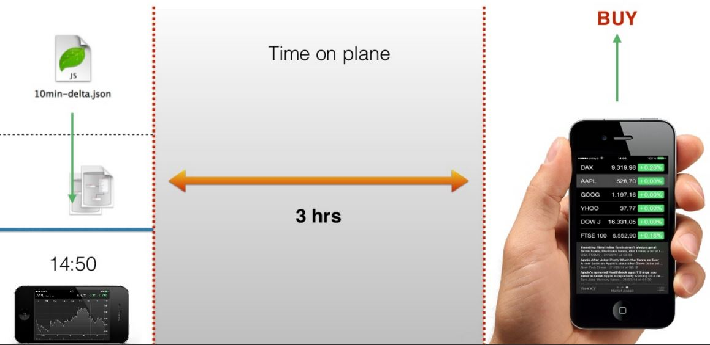

# Own-data and own-net

## What is the own-data and own-net strategy?

The core data for many mobile applications is unique to the user using the application.
Since no one other than the user can change that user's data,
the client can safely mutate the remote data without concern that anyone is doing the same at that same time.

While the client is disconnected, both strategies queue mutation events for later processing when reconnected.
The difference between them is what they queue.

own-data queues every mutation event on the client service, and it will later process each mutation in order on the remote service.
The remote service can react to every mutation.
It may, for example, run hooks which send emails on certain mutations.

own-net queues the net change for each record.
If a record is patched 5 times, own-net queues the record contents after the last of the changes.
If a record created, patched and finally removed, the remote service will not see the mutations at all.
own-net reduces the load on the remote service.

Once the queue is processed, a snapshot refreshes the client service's data.

## Last Mutation Wins Strategy

The own-data and own-net strategies can be viable even when multiple clients may be mutation the same records.
All that will happen is the last mutation made by any client will replace the remote service's record.
This may be acceptable in some use cases.

## own-data Case Study

The realtime case study involved displaying historical stock prices.
Let's now allow the user to buy shares for his own portfolio.

The user will be disconnected if he takes a plane trip,
and he will no longer receive stock price updates.

However he can still make stock purchases.
They will be sent to the server when he reconnects after landing.

#### Sources:

- (**) [MarinTodorov](https://www.slideshare.net/MarinTodorov/overcome-your-fear-of-implementing-offline-mode-in-your-apps?next_slideshow=1)
